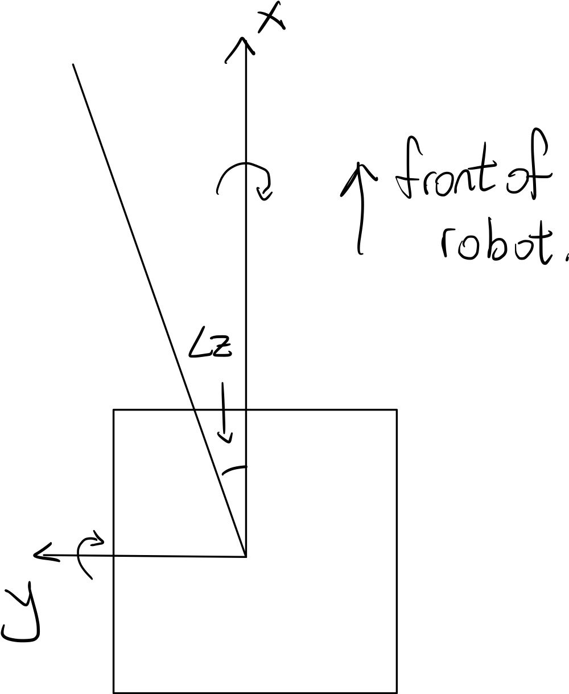
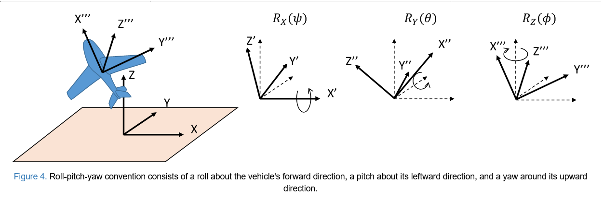
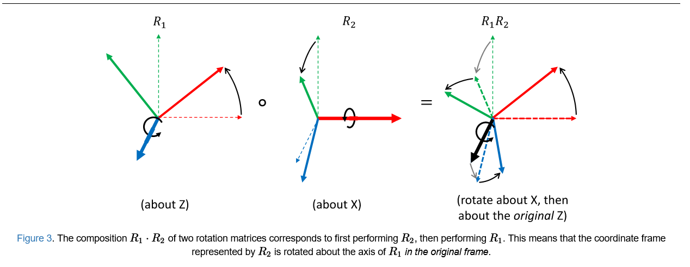
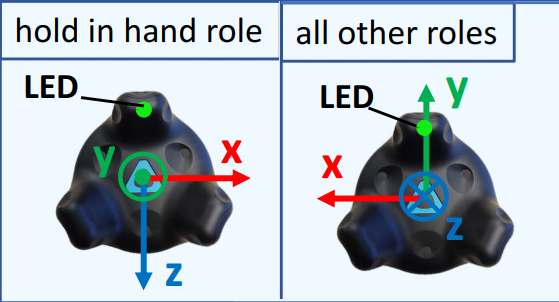
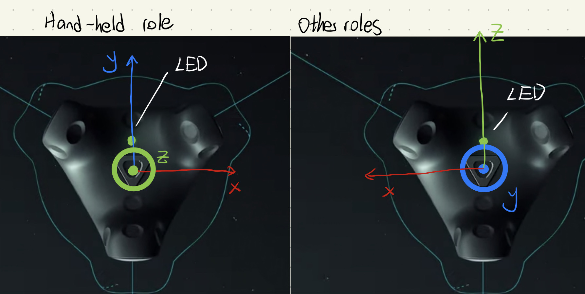

# RAIL_LOCALIZATION_EXP
My experiments for RAIL lab's localization related functionality.

Reference: 
1. https://github.com/kimsama/openvr_vive-trcker_exp
2. Ilya's previous repository
3. http://motion.cs.illinois.edu/RoboticSystems/3DRotations.html
4. https://stackoverflow.com/questions/15022630/how-to-calculate-the-angle-from-rotation-matrix#comment40396622_15029416

## Coordinate Frame (Local)

> Unit: Measured in meters + rads + seconds

### X-Axis

Looking at the origin from the very back of the robot, the X axis extends through the origin point and runs to the front and back.

The X axis values increase to the front.

### Z-Axis

Looking at the origin from the very back of the robot, the Z axis extends through the origin point and runs up and down in a vertical line.

Increasing Z values extend upwards.
### Y-Axis

Looking at the origin from the very back of the robot, the Y axis extends through the origin point and runs to the right and left.

The Y axis values increase to the left.

### Rotation
Looking from the very tip of the axis down towards the origin, the + rotation is counter-clockwise.

roll-pitch-yaw convention often used in aerospace assumes that a vehicle's roll angle is about its X axis, pitch is about its Y axis, and yaw is about its Z axis, with the composite rotation given by:

$$R_{rpy}(\phi,\theta,\psi)=R_Z(\phi)R_Y(\theta)R_X(\psi)$$

We will use this convention for our local coordinate frame, but note that there are other conventions in the form

$$R_{ABC}(\phi,\theta,\psi)=R_A(\phi)R_B(\theta)R_C(\psi)$$

the span of possible results from the convention must span the range of possible rotation matrices, and this means that no two subsequent axes may be the same, e.g., $XXY$ is not permissible, since two combined rotations about one axis are equivalent to a single rotation about that axis.

We can calculate $R_Z, R_Y, R_X$ seperately

And we got

$$R_Z(\psi) = \begin{bmatrix}
\cos(\psi) &-\sin(\psi) &0 \\
\sin(\psi) &\cos(\psi) &0 \\
0 &0 &1
\end{bmatrix}$$

$$R_Y(\theta) = \begin{bmatrix}
\cos(\theta) &0 &\sin(\theta) \\
0 &1 &0 \\
-\sin(\theta) &0 &\cos(\theta)
\end{bmatrix}$$

$$R_X(\phi) = \begin{bmatrix}
1 &0 &0 \\
0 &\cos(\phi) &-\sin(\phi) \\
0 &\sin(\phi) &\cos(\phi)
\end{bmatrix}$$

Then,

$$R_{rpy}(\phi,\theta,\psi)=\begin{bmatrix}
c_1 c_2 & c_1 s_2 s_3 - s_1 c_3 & s_1 s_3 + c_1 s_2 c_3 \\
s_1 c_2 & c_1 c_3 + s_1 s_2 s_3 & s_1 s_2 c_3 - c_1 s_3 \\
s_2 & c_2 s_3 & c_2 c_3
\end{bmatrix}$$

Where

$c_1 = \cos(\phi)$, $s_1 = \sin(\phi)$, $c_2 = \cos(\theta)$, $s_2 = \sin(\theta)$, $c_3 = \cos(\psi)$, $s_3 = \sin(\psi)$

#### Inversion of Rotation
The inverse of an Euler angle $(\phi,\theta,\psi)$ with convention $ABC$ is another set of Euler angles $(−\psi,−\theta,−\phi)$ with convention $CBA$. However, when $C \ne A$, finding the inverse Euler angles in the same convention is much less convenient, because it requires conversion to matrix form and then back to Euler angle form.

## Coordinate Frame(World)

X and Y is the plane on the ground while Z is the vertical axis pointing up.

For easier synchronization, in OpenVR tracking, our X is to the right, Y is to the front, and Z is up.

### Note how Vive Tracker's axes are defined:

> Reference: https://github.com/kimsama/openvr_vive-trcker_exp

Because of this, we will also need to re-define our Vive Tracker's axes

